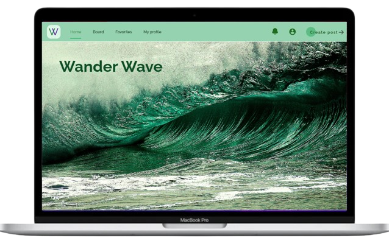
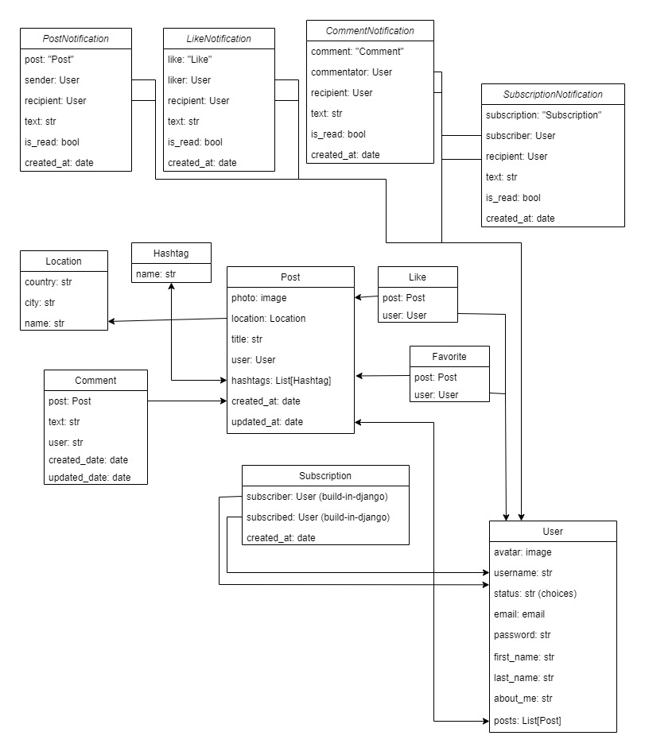

# Wander Wave project 🌎



The project demonstrates a service to share travel experiences. Here you can scroll the posts feed, like, subscribe, comment, etc. The project is made **full stack**.

<hr style="height: 8px">

<br>
The project presents twelfth models:<br>

**backend/wander_wave/:**

- `PostNotification`
- `LikeNotification`
- `CommentNotification`
- `SubscriptionNotification`
- `Location`
- `Hashtag`
- `Post`
- `Comment`
- `Like`
- `Favorite`
- `Subscription`

**backend/user/:**
- `User`

**Here you can you see the database structure:**



The application has quite complex connections between the models, 
since it represents the interaction of a Post with likes and comments, as well as a User with Posts, likes and comments.
But it is important to note that the User model has created using **build-in Django** model and placed in separate app (`user/`).

<br>
<h2>🗺 Wander Wave</h2>

To get started with the project you need to do the following👇:

> Clone the repository
```bash
$ git clone https://github.com/baranovr/wander-wave-project.git
```

<br />

> Install modules via `VENV`  
### 👉 Set Up for `Unix`, `MacOS`
```bash
$ virtualenv env
$ source env/bin/activate
$ pip3 install -r requirements.txt
```

### 👉 Set Up for `Windows`
```bash
$ virtualenv env
$ souce venv\Scripts\activate
$ pip install -r requirements.txt
```

<br />

> Set your environment variables
```bash
$ set DB_HOST=<your DB hostname>
$ set DB_NAME=<your DB name>
$ set DB_USER=<your DB username>
$ set DB_PASSWORD=<your DB user passoword>
$ set SECRET_KEY=<your secret key>
```

<br />

> Set Up Database

```bash
$ python manage.py makemigrations
$ python manage.py migrate
```

<br>

## 📑 Project general features 
📍JWT Token Authentication

📍Viewing posts and comments without authorization

📍Ability to log out

📍Admin panel /admin/

📍Documentation is located at /api/doc/swagger/

📍Creating posts, setting likes, writing comments

📍Viewing and editing personal posts

📍Viewing the number of subscribers/subscriptions

📍Viewing all posts in the application

📍Subscription option

📍Viewing posts from your subscriptions

📍Viewing a list of liked posts

📍Adding hashtags to posts

<br>

<hr>

<h2>🌎🐋 Wander Wave and Docker</h2>
For convenient development and transfer of the project to other users, Docker was introduced here.
The image has been uploaded to Docker Hub:

### Link👇:
> 

How to use (Docker should be installed)👇:

```bash
docker-compose up --build
```

<hr>

## 👮‍♂️ Create Super User

### ⚠️ By default, an unauthorized user does not have the rights to post or comment on anything.
To be able to interact with the platform, you need to log in.
To be able to use the full functionality, you need to be an **admin** (or `superuser`).
To create a superuser you need to run this command and follow the further instructions👇:
```bash
$ python manage.py createsuperuser
```

<br />
<hr>

## To view functionality, go to the following endpoints👇:

## 📋 Registration:

> .../api/user/register/

## 🎫 Get JWT token:

> .../api/user/token/

## 🎫🔄 Refresh access token:

> .../api/user/token/refresh/

## 🎫✅ Verify access token:

> .../api/user/token/verify/

## 💁‍♂️ Check your profile:

> .../api/user/me/

## 👨‍💻 View your posts:

> .../api/user/me/posts/

## 👨‍💻 View your followers/subscriptions accordingly:

> .../api/user/me/subscribers/

> .../api/user/me/subscriptions/

## 👨‍👩‍👦‍👦 View the all users:

> .../api/users/

## ➡️👨‍💻 Follow user:

> .../api/users/<user_id>/subscribe/

## 🔓 Log out:

> .../api/user/me/logout/

## 🔎 Create hashtag(s):

> .../api/media/hashtags/

<br>

<hr style="height: 8px">


<hr style="height: 8px">

## 📂 Code-base structure
```angular2html
< PROJECT ROOT >
  │
  ├── backend/
  │    │
  │    ├── user/                     # User-related functionality (Authentication, User data, etc.)
  │    │   ├── custom_token/          # Custom token implementation for user authentication
  │    │   ├── migrations/            # Database migrations related to the user app
  │    │   ├── __init__.py            # Marks this directory as a Python package
  │    │   ├── admin.py               # Django admin configurations for user models
  │    │   ├── apps.py                # User app configuration
  │    │   ├── models.py              # Database models for user app
  │    │   ├── serializers.py         # Serializers for transforming models into JSON data
  │    │   ├── tests.py               # Unit tests for user app functionality
  │    │   ├── urls.py                # URL routing for user-related endpoints
  │    │   └── views.py               # Views that handle user-related HTTP requests
  │    │
  │    ├── wander_wave/               # Core application handling main functionality
  │    │   ├── management/            # Django management commands
  │    │   ├── migrations/            # Database migrations related to wander_wave app
  │    │   ├── notification_utils/    # Utility functions for notifications
  │    │   ├── __init__.py            # Marks this directory as a Python package
  │    │   ├── admin.py               # Django admin configurations for wander_wave models
  │    │   ├── apps.py                # wander_wave app configuration
  │    │   ├── models.py              # Database models for wander_wave app
  │    │   ├── serializers.py         # Serializers for transforming models into JSON data
  │    │   ├── tests.py               # Unit tests for wander_wave app functionality
  │    │   ├── urls.py                # URL routing for wander_wave-related endpoints
  │    │   └── views.py               # Views that handle wander_wave-related HTTP requests
  │    │
  │    ├── wander_wave_project/       # Main Django project directory
  │    │   ├── __init__.py            # Marks this directory as a Python package
  │    │   ├── asgi.py                # ASGI configuration for asynchronous server support
  │    │   ├── settings.py            # Global Django project settings
  │    │   ├── urls.py                # Global URL routing for the project
  │    │   └── wsgi.py                # WSGI configuration for running the project
  │    │
  │    └── Dockerfile                 # Docker configuration for containerizing the application
  │
  ├── frontend/
  │    │
  │    ├── node_modules/              # Installed dependencies from npm (Node modules)
  │    │
  │    ├── public/                    # Public assets and static files
  │    │
  │    ├── src/                       # Main source code for the frontend
  │    │   ├── api/                   # API utility functions (HTTP requests, data fetching, etc.)
  │    │   ├── app/                   # App-level components and configuration (e.g., Redux store)
  │    │   ├── components/            # Reusable UI components
  │    │   ├── features/              # Domain-specific features for the app
  │    │   ├── helpers/               # Utility and helper functions
  │    │   ├── images/                # Static images used in the project
  │    │   ├── pages/                 # Page components representing views/routes
  │    │   ├── styles/                # Global and reusable style files
  │    │   ├── types/                 # TypeScript type definitions and interfaces
  │    │   ├── App.scss               # Main SCSS stylesheet for the App component
  │    │   ├── App.tsx                # Root component of the React app
  │    │   ├── index.tsx              # Entry point of the React application
  │    │   ├── react-app-env.d.ts     # Environment definition file for TypeScript
  │    │   └── Root.tsx               # Root layout component for managing routing and global state
  │    │
  │    ├── .prettierignore             # Files to ignore by Prettier (code formatting tool)
  │    ├── .prettierrc                 # Prettier configuration for consistent code style
  │    ├── package.json                # Dependencies and scripts for the project
  │    ├── package-lock.json           # Version-locked dependencies
  │    ├── tsconfig.json               # TypeScript configuration file
  │
  ├── .dockerignore               # Files to ignore when building the Docker image
  ├── .env.sample                 # Sample environment variables
  ├── .gitignore                  # Files and directories to be ignored by Git
  ├── docker-compose.yaml         # Docker Compose configuration for multi-container setup
  ├── manage.py                   # Backend management script
  ├── x_readme/
  │    └── *                      # Images for README file
  ├── README.md                   # Project documentation
  ├── requirements.txt            # Python package dependencies
  │
  │-- *********************************************************************************
```